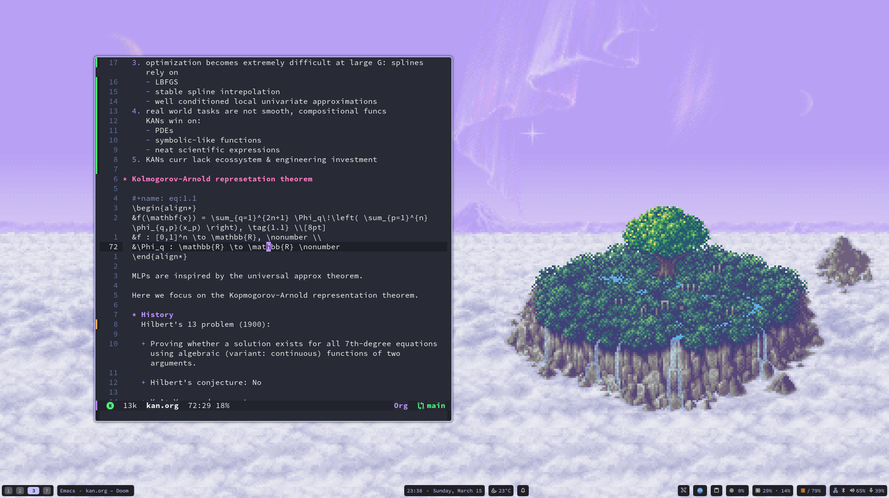
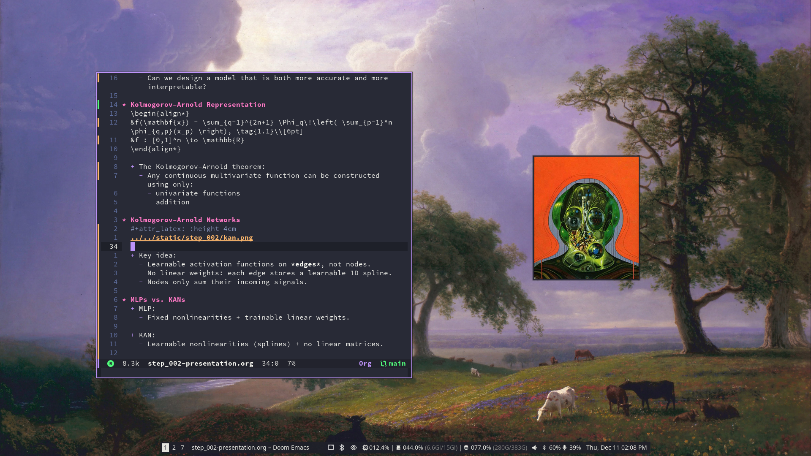
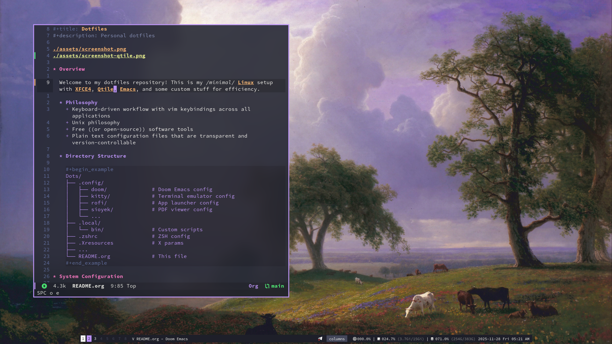

#+title: Dotfiles
#+description: Personal dotfiles

* Nas' inferno

Welcome to my dotfiles repository! This is my /minimal/ GNU/Linux setup.

** Philosophy
+ Keyboard-driven workflow with vim keybindings across all applications
+ Unix philosophy
+ Free ((or open-source)) software tools
+ Plain text configuration files that are transparent and version-controllable

** Directory Structure

#+begin_example
Dots/
├── .config/
│   ├── doom/              # Doom Emacs config
│   ├── kitty/             # Terminal emulator config
│   ├── rofi/              # App launcher config
│   ├── sioyek/            # PDF viewer config
│   └── ...
├── .local/
│   └── bin/               # Personal scripts
├── .zshrc                 # ZSH config
├── .Xresources            # X params
├── ...
└── README.org             # This file
#+end_example

* System Configuration

+ *GNU/Linux*: [[https://archlinux.org][Arch Linux]]
+ *Init System*: [[https://systemd.io/][systemd]]
+ *Package manager*: [[https://github.com/Jguer/yay][yay]]

** Applications
+ *File manager*: [[https://docs.xfce.org/xfce/thunar/start][thunar]] (or =dired=)
+ *Video player*: [[https://mpv.io/][mpv]]
+ *Image viewer*: [[https://github.com/artemsen/swayimg][swayimg]]
+ *PDF viewer*: [[https://sioyek.info/][sioyek]]

** Desktop Environment
+ *Compositor + Quickshell*: [[https://hypr.land/][Hyprland]] + [[https://danklinux.com/][DMS]]

** Dev Tools
+ *Primary Editor*: [[https://github.com/doomemacs/doomemacs][Doom Emacs]]
+ *WebDev Editor*: [[https://vscodium.com/][VSCodium]] with =vim= mode
+ *Terminal emulator*: [[https://sw.kovidgoyal.net/kitty/][kitty]] with =tmux= and [[https://starship.rs/][starship]]
+ *Shell*: [[https://www.zsh.org/][zsh]] with vim mode, history substring search, and syntax highlighting

* Keyboard Layout [WIP]

+ [[https://github.com/foostan/crkbd][corne v2 42-key split keyboard]]
+ [[https://qmk.fm/][QMK firmware]]
+ [[https://github.com/NasreddinHodja/qmk_userspace][my qmk external userpace repo]]

* Legacy
Configs for these are still being used, deleted, or flagged as legacy.

** Hyprland

** Qtile

** XFCE (legacy)
[[./assets/screenshot-xfce.png]]
